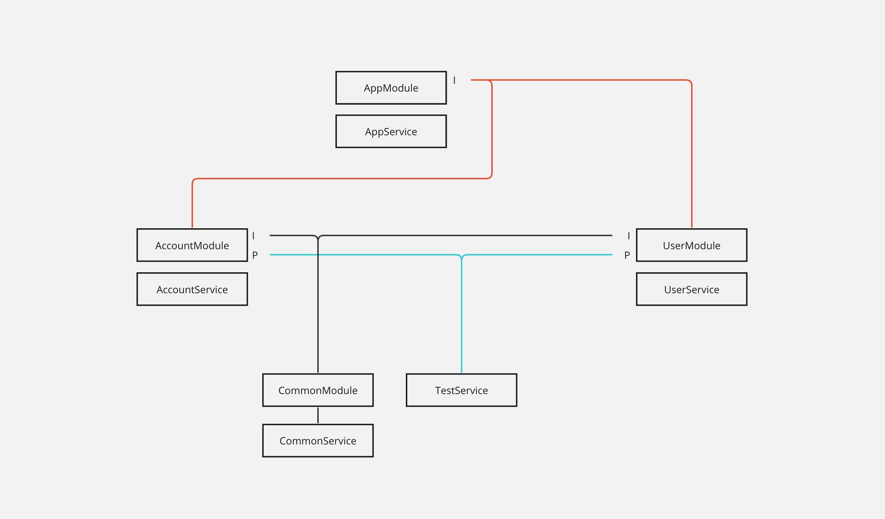

## NestJS Instance Test



### 그림 설명
* 아이콘 
  * I - import
  * P - provider

### dependency
1. TestService 는 AccountModule, UserModule 에 각각 Provider 에서 제공
2. CommonService 는 CommonModule 에서 Provider 되며 TestService 와 AccountModule는 CommonModule 을 import 하여 사용

### 의문점
1. provider 로 각각 제공하면 instance가 개별로 생성된다. 
   * `@Injectable({ scope: Scope.DEFAULT })` 를 설정하더라도 개별로 생성된다.
2. provider 되고있는 module을 각각 import 하면 개별로 생성되지 않고 싱글톤으로 관리된다.

## Test
```javascript
AppService.print() {
    // 각각 provider 된 TestService
    this.validateSameInstance(
      this.accountService.getTestService(),
      this.userService.getTestService(),
    ); // false
    
    // 하나의 모듈에서 import 받아서 각각 사용중인 CommoNService
    this.validateSameInstance(
      this.accountService.getCommonService(),
      this.userService.getCommonService(),
    ); // true
}
```